# SpringBoot REST API Keycloak Auth

## Development setup

### Run Microservices

`docker-compose up`

Available microservices:

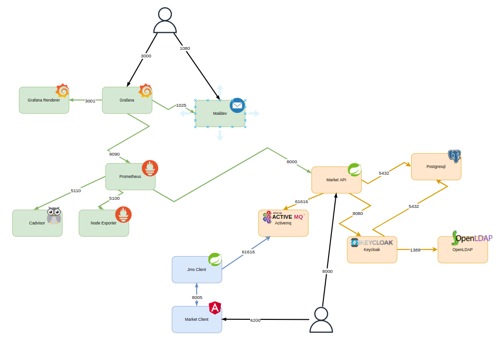

#### **Postgresql**

> Database for keycloak

Port `5432`

#### **Keycloak**

> Authentication server (SSO)

Port `8080` for web ui

Port `9990` for wildfly managment interface

#### **OpenLDAP**

> Users and Groups source (synchronized with Keycloak)

port LDAP `1389`

port LDAPS `1636`

#### **Prometheus**

> Metrics agregator

Port `9090`

#### **Node exporter**

> Linux metrics collector

Port `5100`

#### **Cadvisor**

> Docker metrics collector

Port `5110`

#### **Grafana**

> Metrics visualisation and alerting

Port `3000`

#### **Grafana renderer**

> Transform metrics Graphs to .png images for mailing alerts

Port `3001`

#### **Maildev**

> Development SMTP server for grafana mail alerts

Port SMTP `1025`

Port Webmail `1080`

#### **Activemq**

> Message Broker

Port 61616

### Run backend API

`mvn spring-boot:run`

Open REST API to <http://localhost:8000>
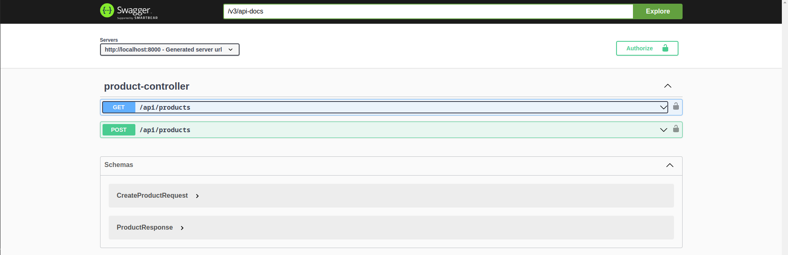

### Add users and assign them to roles

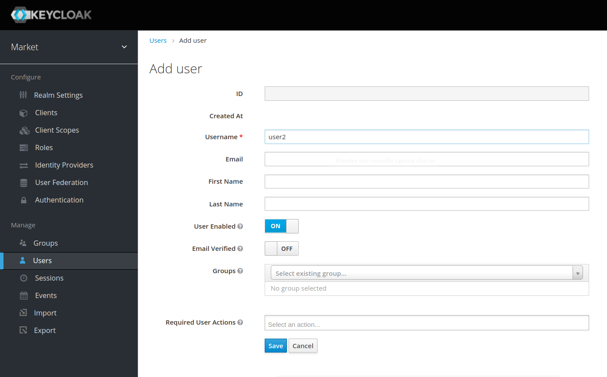
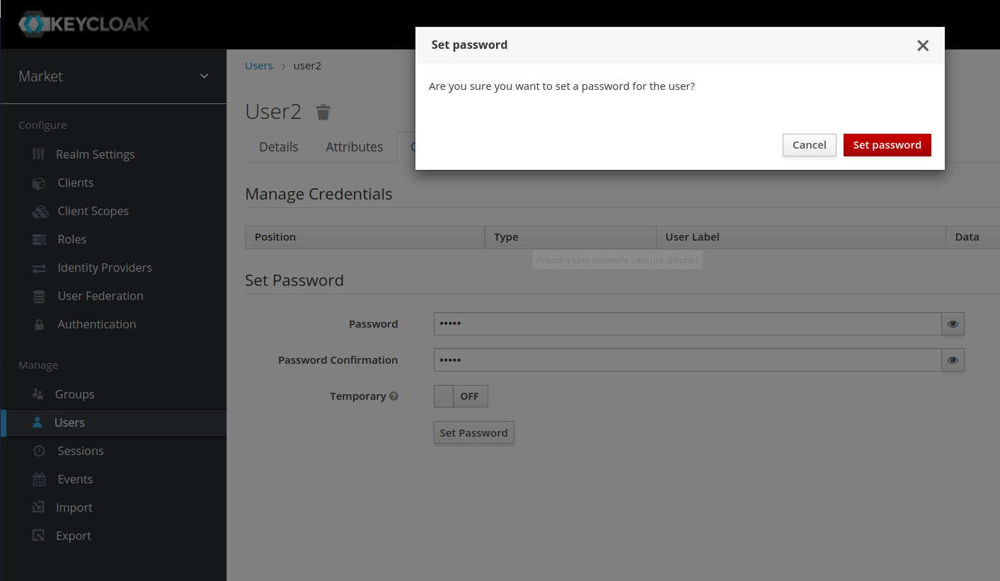
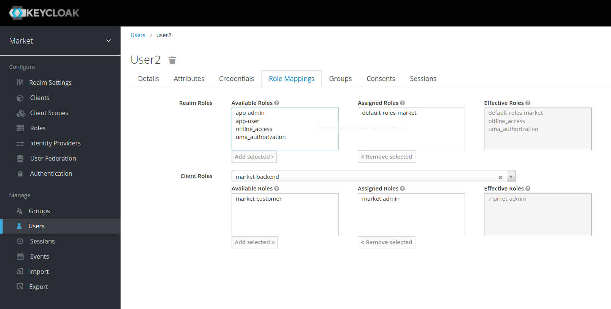

### Generate a token with Postman

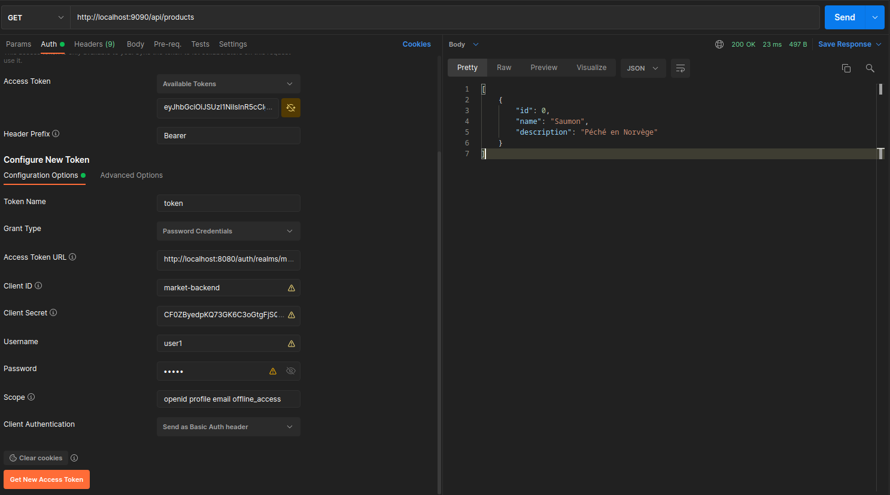

## Tests

### Generate Code Coveage report

`mvn jacoco:prepare-agent test install jacoco:report`

## Monitoring

### With SpringBootAdmin

<http://localhost:8000/admin>
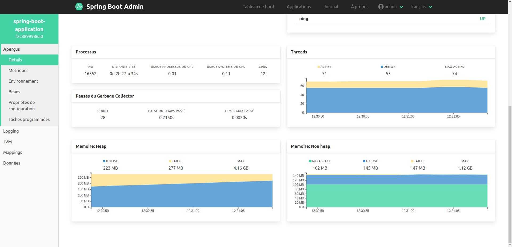

### With grafana:

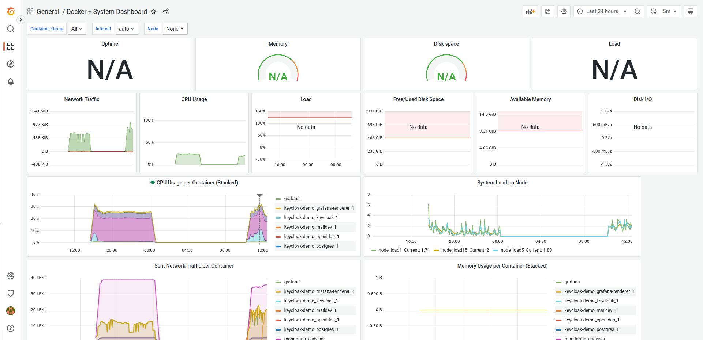
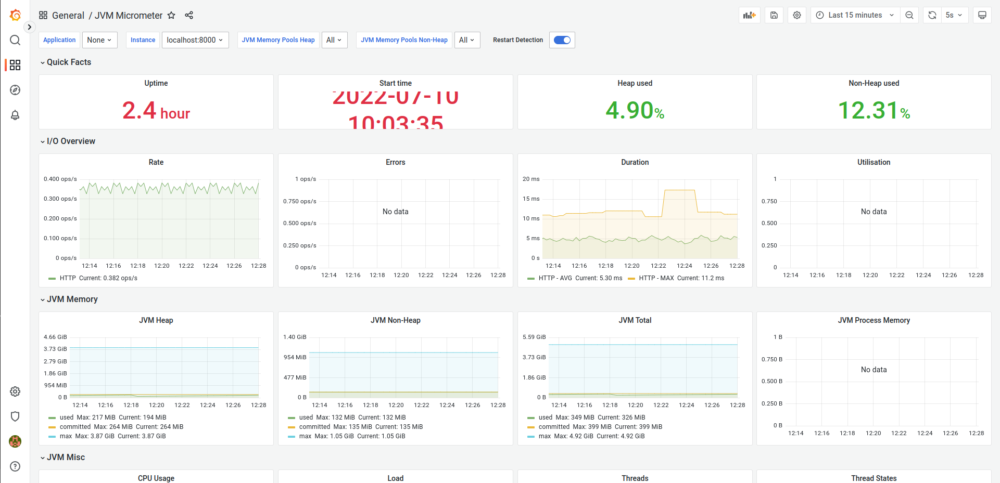
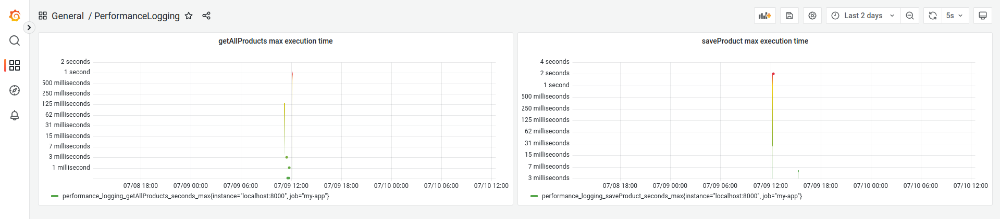
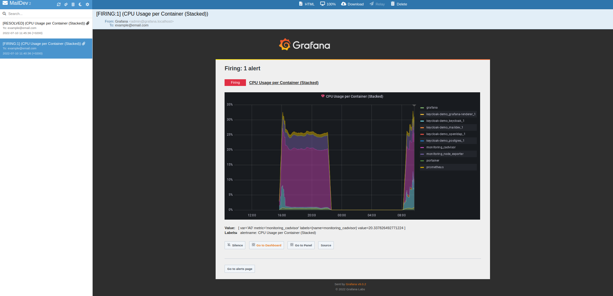
