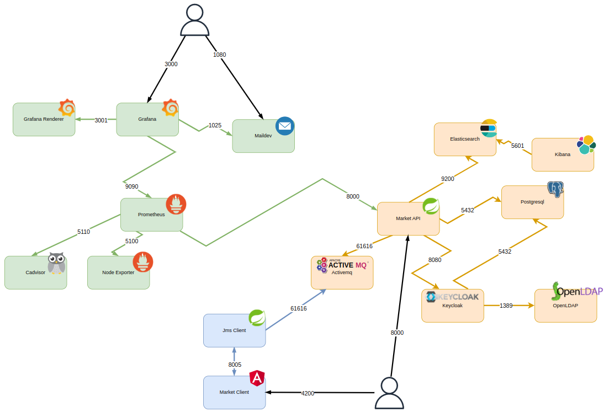

# SpringBoot REST API Keycloak Auth

## Development setup

Java version: JDK 17

Maven version >= 3.8.x

### Run Microservices

`docker-compose up`

Available microservices:



The blue part in the schema is part of the project <https://github.com/trodix/activemq-jms-client>

#### **Postgresql**

> Database for keycloak

Port `5432`

#### **Keycloak**

> Authentication server (SSO)

Port `8080` for web ui

#### **OpenLDAP**

> Users and Groups source (synchronized with Keycloak)

port LDAP `1389`

port LDAPS `1636`

#### **Prometheus**

> Metrics agregator

Port `9090`

#### **Node exporter**

> Linux metrics collector

Port `5100`

#### **Cadvisor**

> Docker metrics collector

Port `5110`

#### **Grafana**

> Metrics visualisation and alerting

Port `3000`

#### **Grafana renderer**

> Transform metrics Graphs to .png images for mailing alerts

Port `3001`

#### **Maildev**

> Development SMTP server for grafana mail alerts

Port SMTP `1025`

Port Webmail `1080`

#### **Activemq**

> Message Broker

Port 61616

#### **Elasticsearch**

> Search engine

Port 9200

#### **Kibana**

> Search engine UI

Port 5601

### Run backend API

`mvn spring-boot:run`

Open REST API to <http://localhost:8000/swagger-ui/index.html>


### Add users and assign them to roles


### Generate a token with Postman


## Tests

### Generate Code Coveage report

`mvn jacoco:prepare-agent test install jacoco:report`

## Monitoring

### With SpringBootAdmin

<http://localhost:8000/admin>


### With grafana:


## Elasticsearch

```

GET _nodes/stats

PUT seafood

PUT seafood/_create/1
{
  "name": "salmon",
  "description": "pink or orange fish"
}

PUT seafood/_create/2
{
  "name": "pasta",
  "description": "with salmon and cream"
}

GET seafood/_doc/1
GET seafood/_doc/2

POST seafood/_update/1
{
  "doc": {
    "name": "salmon",
    "description": "pink or orange fish from norway"
  }
}

DELETE seafood/_doc/akCD_4MB44UVK78OVPPt

GET seafood/_search
{
  "track_total_hits": true
}

GET seafood/_search
{
  "query": {
    "match": {
      "name": {
        "query": "salmon"
      }
    }
  },
  "aggregations": {
    "in_description": {
      "significant_text": {
        "field": "description"
      }
    }
  }
}


GET seafood/_search
{
  "query": {
    "multi_match": {
      "query": "salmon",
      "fields": ["name", "description"]
    }
  }
}

```
